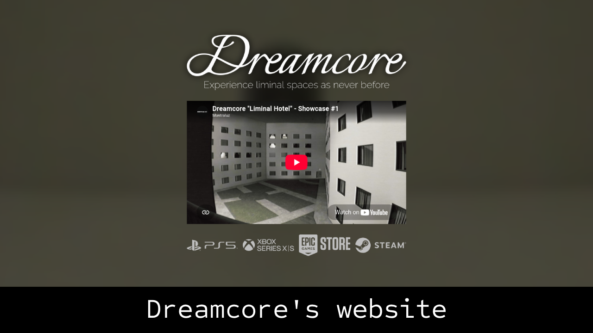
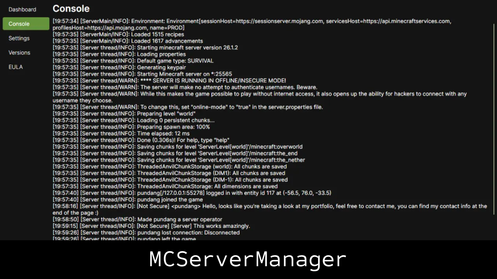

<!-- markdownlint-disable MD033 MD041 -->
<h3 align="center">Welcome to my profile!</h3>
<h5 align="center">Hi 👋, I'm Axel, an 19 years old student from Buenos Aires, Argentina.</h5>

## Featured projects

- [Portfolio](https://pundang.xyz) - My portfolio ❤️.
- [MCServerManager](https://github.com/pundang/mcservermanager) - GUI tool for creating and managing Minecraft Java gameservers.
- [Dreamcore's website](https://www.dreamcoregame.com/) - Website for the game "Dreamcore", by Montraluz.

  
  

## Tech stack

These are the technologies I work with the most for creating fast and flexible applications.

### Languages

### Web development

### Cloud

### Desktop development

### IDEs

## Don't forget to check

- My [Gists profile](https://gist.github.com/pundang)
- My [LinkedIn profile](https://www.linkedin.com/in/pundang/)
- My [YouTube channel](https://www.youtube.com/@apundang)
